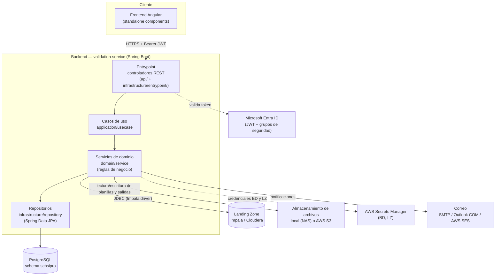
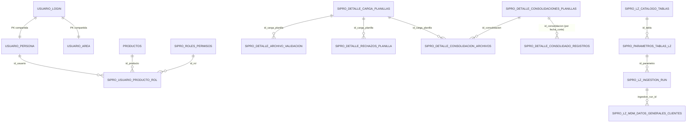
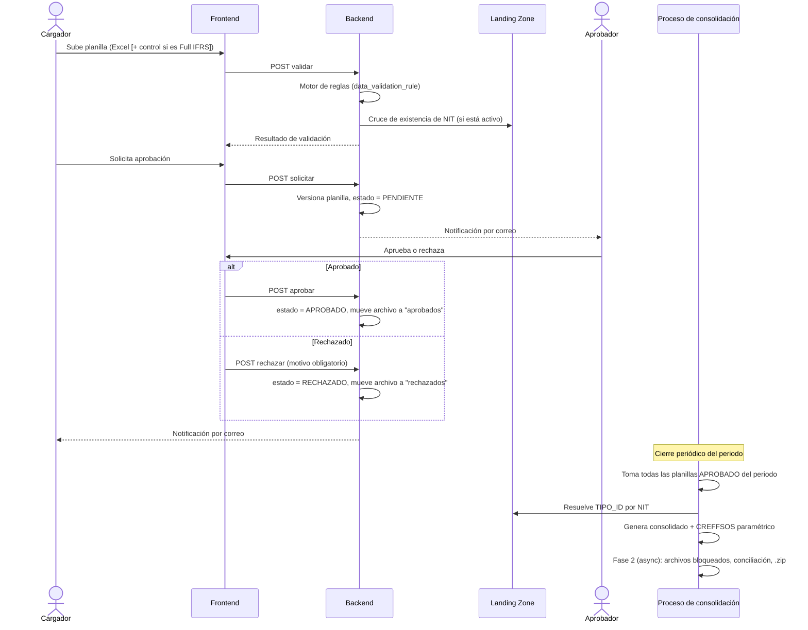
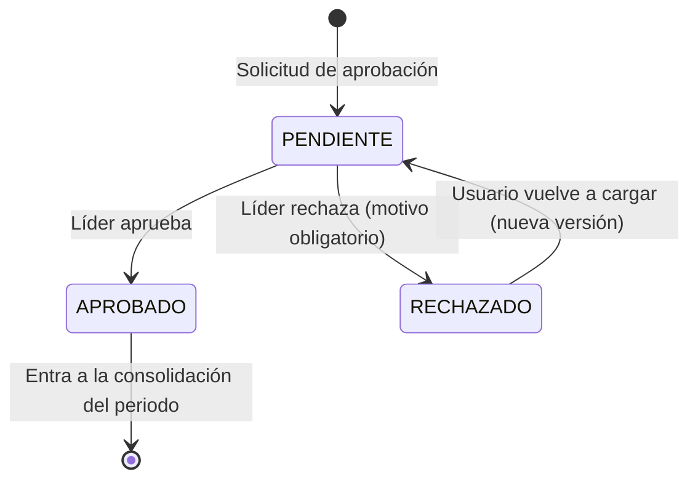

# SIPRO — Sistema Integral de Provisiones

> Documentación técnica generada a partir del análisis directo del código fuente actual del repositorio (backend, frontend, configuración y modelo de datos real vía entidades JPA). **No se usó Liquibase como fuente de verdad del esquema** porque las migraciones están desactualizadas respecto al esquema real — el esquema de base de datos se administra manualmente. Cualquier punto que no se pudo verificar con certeza queda marcado explícitamente como *pendiente de confirmar* en vez de asumirse.

## 1. Introducción / Resumen ejecutivo

SIPRO centraliza el ciclo completo de **carga, validación, aprobación, consolidación y conciliación de planillas manuales de provisiones** para dos segmentos contables:

- **Colgaap/Modificado** (`id_segmento = 1`)
- **Full IFRS** (`id_segmento = 2`)

El resultado final de ese ciclo es un archivo **CREFFSOS** (el formato de entrada del sistema **BankVision**), generado de forma paramétrica a partir de configuración en base de datos, no de lógica fija en código. SIPRO es, en esencia, el punto de control humano (carga → validación automática → aprobación por un líder) antes de que la información de provisiones llegue a BankVision.

Para enriquecer y validar esa información, SIPRO se conecta como cliente de solo lectura a la **Landing Zone corporativa** (un clúster Impala) para cruzar el documento de cada cliente contra un catálogo maestro de clientes y resolver su tipo de identificación.

**Perfiles de usuario (roles funcionales reales, ver [Seguridad y control de acceso](#9-seguridad-y-control-de-acceso)):** Cargador, Aprobador, Usuario_Analista, Auditoría, Soporte Técnico y Admin_Permisos.

**Nota sobre el alcance de este documento:** el repositorio también contiene una carpeta `ABA/` en la raíz. **No es parte de SIPRO** — es un proyecto Spring Boot completamente independiente (su propio `.git`, su propio build Gradle, su propio Dockerfile), que vive físicamente junto a SIPRO solo por conveniencia de espacio de trabajo. La única relación real es de referencia: SIPRO reutiliza la misma librería corporativa de AWS Secrets Manager que usa ABA, y ABA dejó documentado un patrón de envío de correo por AWS SES (`ABA/SES_HANDOFF.md`) pensado para que SIPRO lo replicara. Este README no documenta ABA.

## 2. Índice

- [1. Introducción / Resumen ejecutivo](#1-introducción--resumen-ejecutivo)
- [3. Arquitectura general](#3-arquitectura-general)
- [4. Stack tecnológico](#4-stack-tecnológico)
- [5. Estructura del repositorio](#5-estructura-del-repositorio)
- [6. Módulos funcionales](#6-módulos-funcionales)
- [7. Modelo de datos](#7-modelo-de-datos)
- [8. Integración con Landing Zone (Impala)](#8-integración-con-landing-zone-impala)
- [9. Seguridad y control de acceso](#9-seguridad-y-control-de-acceso)
- [10. Configuración y variables de entorno](#10-configuración-y-variables-de-entorno)
- [11. Almacenamiento de archivos](#11-almacenamiento-de-archivos)
- [12. Despliegue e infraestructura](#12-despliegue-e-infraestructura)
- [13. Flujos operativos principales](#13-flujos-operativos-principales)
- [14. Glosario](#14-glosario)
- [15. Consideraciones y estado actual](#15-consideraciones-y-estado-actual)

## 3. Arquitectura general

SIPRO es un backend único (`validation-service`, Spring Boot) consumido por un frontend Angular, con PostgreSQL como base de datos transaccional y tres integraciones externas: el proveedor de identidad corporativo (Entra ID), la Landing Zone analítica (Impala) y almacenamiento de archivos (local/NAS o S3, según ambiente).



La arquitectura del backend es **hexagonal reconocible pero no estrictamente pura**: existe una capa de entrada, una capa de casos de uso, una capa de dominio y una capa de infraestructura, pero conviven restos de una reestructuración incompleta (ver [Estructura del repositorio](#5-estructura-del-repositorio) y [Consideraciones](#15-consideraciones-y-estado-actual)). La mayor parte de la lógica de negocio vive en **servicios de dominio** (36 clases) más que en casos de uso propiamente dichos (solo 6 clases), lo que en la práctica significa que los servicios de dominio orquestan directamente en vez de delegar siempre a un caso de uso intermedio.

## 4. Stack tecnológico

| Capa | Tecnología | Notas |
|---|---|---|
| Backend | Java 17 (toolchain Gradle) | |
| Backend | Spring Boot 3.4.0 | |
| Backend | Spring Data JPA, Spring Security, Spring Mail, Spring Cache (Caffeine) | |
| Backend | PostgreSQL (driver `org.postgresql:postgresql:42.7.1`) | Esquema `schsipro`. Administrado manualmente (ver [Consideraciones](#15-consideraciones-y-estado-actual)) |
| Backend | Apache POI `5.2.5` | Lectura/escritura de Excel (planillas, CREFFSOS, reportes) |
| Backend | Apache Commons JEXL `3.3` | Motor de fórmulas del motor de reglas de validación |
| Backend | Driver JDBC Impala (`ImpalaJDBC42.jar`, dependencia local en `libs/`) | Conexión a la Landing Zone |
| Backend | AWS SDK v2 (S3, SES v2) + librería corporativa `aws-secrets-manager-sync` | Misma librería de secretos que usa el proyecto ABA |
| Backend | Gradle (build multi-módulo, un único módulo real: `services:validation-service`) | Empaqueta `sipro.jar` |
| Frontend | Angular `^20.0.0` (componentes standalone, sin `NgModule` activo) | Bootstrap vía `main.ts` + `app.routes.ts` |
| Frontend | TypeScript `~5.8.3` | |
| Frontend | RxJS `~7.8.0` | |
| Frontend | `@azure/msal-browser` `^4.26.1` | Autenticación contra Entra ID desde el navegador |
| Frontend | `xlsx` `^0.18.5` | Manejo de Excel en cliente |
| Contenedor | `eclipse-temurin:21-jdk` (build) → `eclipse-temurin:21-jre` (runtime) | El contenedor corre en JRE 21 aunque el código compila con toolchain Java 17 |

## 5. Estructura del repositorio

```
SIPRO/
├── backend/
│   ├── settings.gradle                  # único módulo: services:validation-service
│   ├── deployment/                      # Dockerfile + chart Helm base (ver sección 12)
│   └── services/validation-service/
│       ├── build.gradle
│       └── src/main/
│           ├── java/com/bancolombia/sipro/validations/
│           │   ├── api/                      # controladores REST (grupo 1, ver más abajo)
│           │   ├── application/
│           │   │   ├── usecase/              # 6 casos de uso (login, planilla, validación, ingesta LZ, acta)
│           │   │   └── dto/
│           │   ├── domain/
│           │   │   ├── service/              # ~36 servicios de dominio — el grueso de la lógica de negocio
│           │   │   └── model/                # ~32 entidades JPA
│           │   ├── infrastructure/
│           │   │   ├── entrypoint/           # controladores REST (grupo 2, ver nota abajo)
│           │   │   ├── config/                # seguridad, JPA, storage, LZ, panel admin
│           │   │   ├── repository/            # repositorios Spring Data JPA (grueso)
│           │   │   ├── persistence/           # segunda jerarquía de repos/entidades (legado, ver sección 15)
│           │   │   ├── security/              # validación de JWT Entra ID, filtros, RBAC
│           │   │   ├── storage/                # implementaciones local/S3 de FileStorageService
│           │   │   ├── lz/                     # cliente JDBC a Impala, manejo de secretos LZ
│           │   │   ├── notification/           # envío de correo (4 transportes)
│           │   │   └── adapters/{in,out}/      # adaptadores puerto-entrante/saliente
│           │   ├── model/ y service/           # paquetes sueltos fuera de domain/ (legado, ver sección 15)
│           │   └── shared/                     # utilidades y excepciones comunes
│           └── resources/
│               ├── application*.yml            # config por ambiente (ver sección 10)
│               └── db/changelog/                # Liquibase — INACTIVO, no es fuente de verdad del esquema
├── frontend/
│   └── src/
│       ├── main.ts                      # bootstrap standalone real
│       ├── environments/                # config por ambiente (apiUrl, credenciales Azure)
│       └── app/
│           ├── app.routes.ts            # rutas activas (8 rutas + guards)
│           ├── guards/                  # 7 guards funcionales
│           ├── interceptors/            # inyección de Bearer token
│           ├── services/                # clientes HTTP hacia el backend
│           ├── models/
│           └── components/              # login, inicio, cargar, aprobacion, resumen, admin, parametros, tablero
└── ABA/                                 # proyecto independiente, no forma parte de SIPRO (ver sección 1)
```

**Nota sobre controladores duplicados:** los controladores REST están repartidos en dos paquetes distintos sin un criterio único documentado — `api/` (`ActaController`, `ConfigController`, `HealthController`, `LzTestController`, `ValidationController`) e `infrastructure/entrypoint/` (`AdminController`, `AuthController`, `LzIngestionController`, `MainController`, `ParametrosController`, `PlanillaController`). No hay un único punto de entrada centralizado; ver [Consideraciones](#15-consideraciones-y-estado-actual).

## 6. Módulos funcionales

### Carga y validación de planillas

Un usuario sube un archivo Excel (Colgaap) o Excel + archivo de control `.txt` (Full IFRS, con la cantidad de registros esperada) y el sistema lo valida en caliente contra un **motor de reglas 100% parametrizado en la tabla `data_validation_rule`** — no hay reglas de negocio de estructura, tipo de dato o fecha hardcodeadas en Java para esta parte. El motor soporta 5 tipos de regla: `FIELD` (obligatoriedad, tipo de dato, longitud, regex, lista de valores, o una fórmula JEXL libre), `COMPOSITE_DATE` (arma y valida una fecha desde 3 columnas año/mes/día), `DATE_RELATION` (compara fechas entre sí o contra la fecha de corte elegida), y `CTRL_CONTENT`/`CTRL_RECORD_COUNT` (exclusivas del archivo de control de Full IFRS).

Además del motor parametrizado, existen validaciones de negocio fijas en código: unicidad de DOCUMENTO+MONEDA por archivo, exclusión del NIT propio de Bancolombia, existencia del NIT contra la Landing Zone (activable/desactivable por parámetro), y existencia de la cuenta contable (CTAPUC) contra la tabla de homologación SAP (solo Colgaap). *No se encontró una regla de "cuadre contable" (partida doble) implementada de forma fija — si existe, viviría como una fórmula JEXL configurada en la tabla de reglas, lo cual no se puede confirmar sin consultar la base de datos real (pendiente de confirmar).*

### Aprobación y rechazo

Una vez validada, el usuario "solicita aprobación": el archivo se versiona (la versión anterior del mismo producto+fecha se inactiva) y nace en estado `PENDIENTE`. Solo el **líder asignado a esa planilla específica** (`id_lider`) puede aprobar o rechazar — la autorización efectiva de esta acción se valida contra ese campo, no contra el flag genérico de rol "aprobar". El rechazo exige un motivo obligatorio, validado tanto en el controlador como en la persistencia del registro de auditoría. Cada acción (solicitud, aprobación, rechazo) dispara una notificación por correo.

### Consolidación

Cierre periódico (mensual) que reconstruye por completo el consolidado de un periodo a partir de las planillas aprobadas, en paralelo para los dos segmentos, y termina generando el archivo CREFFSOS. Incluye protección contra ejecuciones concurrentes para el mismo periodo, un límite de tiempo configurable para que una ejecución nunca quede indefinidamente "colgada", y una segunda fase asíncrona ("Fase 2 / archivos bloqueados") que publica copias protegidas contra edición del CREFFSOS, de las planillas Full IFRS aprobadas y de un reporte de conciliación, comprimidas en un `.zip` por periodo.

### Generación paramétrica de CREFFSOS

El layout de columnas del archivo de salida CREFFSOS se define en la tabla `sipro_parametros_columnas_creffsos` (accedida por SQL directo, no es una entidad JPA) y se resuelve en tiempo de ejecución mediante un catálogo cerrado de ~15 funciones Java registradas (copiar directo, asignar constante, resolver consecutivo, resolver clasificación PUC, cruces contra la LZ, etc.), no mediante expresiones SQL libres por columna (ese campo existe en el esquema pero no se usa — ver [Consideraciones](#15-consideraciones-y-estado-actual)). El formato de salida (XLSX/CSV/TSV), el nombre del archivo y si incluye encabezado son configurables por parámetro.

### Conciliación

Compara el consolidado interno contra el archivo CREFFSOS ya publicado y genera un reporte Excel con el resumen por producto y el detalle de diferencias, si las hay.

### Panel de administrador

Expone un dashboard operativo (periodos, estado de ventana de carga, archivos pendientes/rechazados, histórico de consolidaciones), una consola SQL restringida (bloquea DDL peligroso y exige `WHERE` en escrituras, aunque su lista blanca de tablas es hoy solo informativa para el frontend, no una barrera real — ver [Consideraciones](#15-consideraciones-y-estado-actual)), gestión de parámetros del sistema, y un visor de logs operativos en vivo (por *polling*, no un stream real).

### Integración con Landing Zone

Ver sección dedicada: [Integración con Landing Zone (Impala)](#8-integración-con-landing-zone-impala).

## 7. Modelo de datos

Todas las tablas viven en el esquema `schsipro`. El modelo se agrupa en cuatro dominios funcionales.

### Identidad, RBAC y catálogos

| Tabla | Propósito |
|---|---|
| `usuario_login` | Identidad raíz del usuario (usuario, clave) |
| `usuario_persona` | Datos personales, extiende `usuario_login` por PK compartida |
| `usuario_area` | Área organizacional y jefe/líder (auto-referenciada), extiende `usuario_login` por PK compartida |
| `sipro_roles_permisos` | Catálogo de roles con matriz de permisos por acción (`visualizar`, `cargar_archivos`, `aprobar`, `modificar_parametros`, etc.) y el `grupo_ad` de Entra ID asociado |
| `sipro_usuario_producto_rol` | Tabla puente RBAC real: llave compuesta `id_usuario + id_producto + id_rol + id_segmento` |
| `productos` | Catálogo maestro de productos cargables |
| `segmentos` | Catálogo maestro de segmentos (Colgaap/Modificado, Full IFRS) |

### Parametrización y reglas

| Tabla | Propósito |
|---|---|
| `data_validation_rule` | Motor de reglas de validación configurable (ver [módulo de carga](#6-módulos-funcionales)) |
| `sipro_parametros_unico` | Parámetros clave-valor genéricos del sistema |
| `sipro_parametros_columnas_creffsos` | Layout configurable del archivo CREFFSOS (no es entidad JPA, acceso por SQL directo) |
| `sipro_parametros_homologacion_colgaap` / `sipro_parametros_homologacion_full_ifrs` | Homologación de cuentas contables SAP↔BV / SAP↔planilla, por segmento |
| `sipro_parametros_reglaventanacarga` | Regla general de apertura/cierre de la ventana de carga |
| `sipro_parametros_excepcionventanacarga` | Excepciones puntuales por periodo a esa ventana |
| `sipro_parametros_rango_habilitado` | Rango de meses habilitado en el selector de fecha de corte |

### Carga, consolidación y conciliación

| Tabla | Propósito |
|---|---|
| `sipro_detalle_carga_planillas` | Planilla cargada: ruta de almacenamiento, `estado_planilla`, `id_lider`, fecha de corte |
| `sipro_detalle_archivo_validacion` | Métricas de calidad de la validación de un archivo |
| `sipro_detalle_rechazos_planilla` | Auditoría de rechazos (motivo, etapa, usuario) |
| `sipro_resumen_por_moneda` | Resumen por moneda de una validación |
| `sipro_detalle_consolidaciones_planillas` | Cabecera de una corrida de consolidación por periodo (`estado_consolidacion`) |
| `sipro_detalle_consolidacion_archivos` | Relación de cada archivo aprobado que entró en una consolidación |
| `sipro_detalle_consolidado_registros` | Fila consolidada individual (una por registro de negocio) |

**Estados reales confirmados en código** (no hay enum central; se reconstruyeron de literales en uso y de un `CHECK constraint` gestionado en `PartitionInitializer.java`, la fuente de verdad real del esquema dado que Liquibase está inactivo):
- `estado_planilla`: `PENDIENTE`, `APROBADO`, `RECHAZADO` (más variantes de presentación en el frontend para el caso "sin datos").
- `estado_consolidacion`: `INICIADO`, `EN_PROCESO`, `COMPLETADO`, `COMPLETADO_CON_ADVERTENCIAS`, `ERROR`.
- `estado` de un run de ingesta LZ: `STARTED`, `SUCCESS`, `FAILED`, `INCOMPLETE`.

El discriminador de segmento (`id_segmento`/`idSegmento` = 1 Colgaap/Modificado, 2 Full IFRS) aparece repetido como constante en varios servicios (no hay un enum ni una única fuente), y en varias tablas conviven con un campo `segmento` de texto libre (nombre), sin llave foránea tipada entre ambos.

### Landing Zone

| Tabla | Propósito |
|---|---|
| `sipro_lz_catalogo_tablas` | Catálogo de tablas replicables desde la LZ |
| `sipro_parametros_tablas_lz` | Parámetro de ingesta con el `query_sql` completo a ejecutar en Impala |
| `sipro_lz_ingestion_run` (+ variante `_default`) | Control/histórico de cada ejecución de ingesta |
| `sipro_lz_mdm_datos_generales_clientes` (+ `_stg`, `_default`, `_stg_default`) | Tabla espejo de clientes MDM: staging, destino final y particiones `DEFAULT` de PostgreSQL |

### Diagrama entidad-relación (grupos principales)



> **Nota importante:** salvo la relación `SIPRO_PARAMETROS_TABLAS_LZ → SIPRO_LZ_CATALOGO_TABLAS`, la enorme mayoría de estas relaciones **no están declaradas como `@ManyToOne`/`@JoinColumn` en JPA** — son columnas numéricas sueltas (`Long`/`Integer`) que se relacionan solo a nivel de dato, no de objeto. El diagrama refleja la relación lógica de negocio, no necesariamente una llave foránea física declarada. Ver [Consideraciones](#15-consideraciones-y-estado-actual).

## 8. Integración con Landing Zone (Impala)

La **Landing Zone** es la capa corporativa de datos analíticos de Bancolombia, expuesta vía un clúster **Impala/Cloudera**. SIPRO se conecta como cliente de **solo lectura**, sin pool de conexiones (cada operación abre y cierra su propia conexión JDBC, decisión deliberada para no mantener conexiones permanentes contra un sistema externo).

**Para qué se usa dentro de SIPRO:**
1. **Validación de existencia de NIT** durante la carga de planillas: se cruza el documento del cliente contra el catálogo maestro replicado, activable/desactivable por parámetro.
2. **Resolución del tipo de identificación (`TIPO_ID`)** durante la consolidación (Colgaap y Full IFRS), cuando el archivo de origen no lo trae.

**Mecanismo de conexión:** driver JDBC nativo de Impala, autenticación LDAP (usuario/clave) sobre TLS, con un truststore propio aislado del truststore SSL global de la JVM (para no interferir con la validación de tokens de Entra ID, que también usa HTTPS).

**Ingesta periódica (replicación hacia PostgreSQL):** un proceso programado trae los datos del catálogo de clientes a una tabla espejo local, con un flujo *staging → validación de conteos → promoción transaccional a la tabla final*. Incluye salvaguardas reales:
- Un guard de concurrencia que evita que dos ingestas de la misma tabla corran en paralelo.
- Un guard por periodo: si el mes actual ya tuvo una ejecución exitosa, no se repite (salvo forzado).
- Recuperación automática de ejecuciones interrumpidas (por ejemplo, si el servidor se reinició a mitad de proceso): cualquier ejecución que quede "en curso" más tiempo del esperado se marca como fallida automáticamente, y se limpian los datos parciales huérfanos.
- Disparo automático en tres momentos: una verificación única poco después de arrancar el backend, y un chequeo diario que **fuerza** la ingesta el día 1 y el último día de cada mes (dos fotos obligatorias del mes), actuando como reintento silencioso de respaldo el resto de los días.

**Credenciales por ambiente:**

| Ambiente | Mecanismo |
|---|---|
| Desarrollo | Bypass directo por variables de entorno (usuario/clave de prueba), o AWS Secrets Manager simulado (LocalStack) |
| QA / Producción | AWS Secrets Manager real — las variables de bypass deben quedar vacías |

El código emite una advertencia explícita en el log de arranque si el bypass de desarrollo queda activo, **pero no existe ningún bloqueo técnico** que impida activarlo por error en QA/producción — es una convención de configuración, no una salvaguarda forzada por código. Ver [Consideraciones](#15-consideraciones-y-estado-actual).

## 9. Seguridad y control de acceso

### Autenticación

El frontend autentica al usuario contra **Microsoft Entra ID** (vía MSAL) y envía el ID token al backend (`POST /api/auth/login`). El backend valida ese JWT de forma real contra el JWKS de Entra ID (issuer, audiencia, firma) — **esto contradice documentación previa dentro del propio repositorio** que afirmaba que la seguridad estaba "relajada" sin validación real de JWT; el código actual sí exige y valida un token real en cada petición protegida. Ver [Consideraciones](#15-consideraciones-y-estado-actual).

Cada petición subsiguiente pasa por un filtro que revalida el token y exige que el usuario **ya exista previamente** en SIPRO — no hay auto-registro (auto-provisioning): si el usuario no existe, la petición se rechaza.

### Autorización (RBAC)

Los grupos de seguridad del usuario llegan en el propio ID token (claim `groups`); si el usuario pertenece a demasiados grupos para caber en el token, se complementa con una consulta a Microsoft Graph. Esos grupos se normalizan (minúsculas, sin guiones/espacios/prefijos corporativos) y se cruzan contra la columna `grupo_ad` de `sipro_roles_permisos` (también normalizada) para determinar los roles efectivos del usuario — **ese mapeo vive en base de datos, no en código ni en ningún archivo de configuración**. Con los roles efectivos ya resueltos, se filtran las asignaciones de `sipro_usuario_producto_rol` para obtener los permisos reales por producto.

```mermaid
flowchart LR
    A["Usuario se autentica\ncon Entra ID (MSAL)"] --> B["ID token con claim\n'groups' (GUIDs de grupo)"]
    B --> C["Backend valida el JWT\ncontra JWKS de Entra ID"]
    C --> D["Grupos se normalizan\n(GroupNameNormalizer)"]
    D --> E["Se cruzan contra\nsipro_roles_permisos.grupo_ad"]
    E --> F["Roles funcionales\nefectivos del usuario"]
    F --> G["Se filtran asignaciones en\nsipro_usuario_producto_rol"]
    G --> H["Permisos finales\npor producto/segmento"]
```



**Roles funcionales reales** (reconstruidos de constantes/comentarios en el código — no existe un único archivo que los liste todos juntos, y los nombres/`grupo_ad` exactos se administran en base de datos, no versionados):

| id_rol | Rol | Controla, entre otros |
|---|---|---|
| 1 | Cargador *(inferido con menor certeza — ver Consideraciones)* | Carga de archivos |
| 2 | Aprobador | Aprobación/rechazo de planillas |
| 3 | Soporte Técnico | Acceso al panel admin (dashboard técnico, consola SQL, logs) |
| 4 | Usuario_Analista | — |
| 5 | Auditoría | — |
| 6 | Admin_Permisos | Gestión de parámetros, ejecución de consolidación manual |

> Documentación técnica previa del proyecto mencionaba en un momento 6 roles y en otro 5 roles con nombres distintos. El código actual apunta consistentemente a **estos 6 roles** — ni la lista vieja de 6 ni la de 5 coincide exactamente con lo que hay hoy; trátese como la referencia vigente hasta que se confirme contra la base de datos real.

**Endpoints públicos** (sin autenticación): health checks, `/error`, login, y la configuración pública de Entra ID. **Todo lo demás exige un token válido.** No hay autorización declarativa por rol a nivel de Spring Security (`hasRole`/`@PreAuthorize`) — la restricción fina por rol (por ejemplo, quién entra a `/admin` o a `/parametros`) se hace de forma imperativa dentro de los propios servicios, lo que significa que depende de que cada endpoint invoque explícitamente el chequeo correcto.

### Manejo de secretos

- El secreto de Entra ID (`AZURE_CLIENT_SECRET`) y otros 3 parámetros críticos se leen **exclusivamente** de configuración/variables de entorno — nunca de la tabla de parámetros de base de datos, aunque exista un valor ahí, precisamente para que ese secreto nunca quede en BD.
- Credenciales de la base de datos principal y de la Landing Zone: AWS Secrets Manager en QA/producción (LocalStack en desarrollo).
- No se encontraron credenciales reales de producción quemadas en el código. Sí existen un puñado de valores de conveniencia exclusivos de desarrollo local (contraseña de BD local, credenciales de prueba de LocalStack, contraseña por defecto estándar de un truststore Java) que no aplican fuera de ese ambiente.
- Existe una contraseña de protección de hojas de Excel (`"sipro-readonly"`) repetida en 5 archivos distintos — es solo una protección de edición casual de Excel, no un control de acceso real; ver [Consideraciones](#15-consideraciones-y-estado-actual).

## 10. Configuración y variables de entorno

El backend usa perfiles de Spring (`application-<perfil>.yml`) más un archivo especial **autosuficiente** para despliegues (`application-cloud.yml`), pensado para arrancar el JAR apuntando directamente a él, con tokens `#{VARIABLE}#` que el pipeline corporativo reemplaza según el ambiente (patrón "Replace Tokens" de Azure DevOps).

| Archivo | Cuándo se usa |
|---|---|
| `application.yml` | Base común; defaults genéricos (storage S3/LocalStack, transporte de correo `outlook-win32` deshabilitado) |
| `application-dev.yml` | Ejecución local desde IDE en la máquina del desarrollador |
| `application-qa.yml` | Perfil `qa` (hereda buena parte de los defaults de `application.yml` si no se pasa por `application-cloud.yml`) |
| `application-prd.yml` | Perfil `prd` |
| `application-prd-replacetokens.yml` | Plantilla inactiva salvo que se active explícitamente ese perfil |
| `application-cloud.yml` | El que realmente se usa en los despliegues dev/qa/prd en la nube, vía reemplazo de tokens |

**Diferencias clave por ambiente:**

- **Almacenamiento:** local apuntando a un recurso compartido de red (NAS Windows) en desarrollo y en los despliegues cloud reales; S3/LocalStack solo aplica al perfil "puro" sin pasar por `application-cloud.yml`. Ver [Almacenamiento de archivos](#11-almacenamiento-de-archivos).
- **Landing Zone:** desarrollo y QA comparten el mismo host intermedio con datos de prueba sembrados automáticamente; producción apunta al host corporativo real, sin datos sembrados.
- **Correo:** desarrollo fuerza modo "preview" (solo registra en log, no envía nada real); producción usa AWS SES vía API; el resto de ambientes puede usar SMTP u Outlook (vía automatización COM en un host Windows on-prem), transporte que es el *default* global del sistema.
- **Base de datos:** el tamaño del pool de conexiones crece de un valor pequeño en desarrollo genérico a 30 conexiones en producción/cloud.
- **Gestor de secretos:** LocalStack (simulado) en desarrollo local, AWS Secrets Manager real en el resto.
- **Entra ID / URLs de cada ambiente:** se leen siempre de configuración o variables de entorno, nunca de la base de datos.
- **CORS y credenciales de S3 en producción** quedan sin valor por defecto a propósito — si el pipeline no las inyecta, el sistema falla de forma segura (bloqueando) en vez de abrir algo sin querer.

**Variables más relevantes para un primer despliegue** (nombres, no valores): perfil de Spring activo, credenciales/URL de base de datos (o el nombre del secreto en Secrets Manager), tipo de almacenamiento y su ruta/bucket, orígenes permitidos de CORS, credenciales de la aplicación de Entra ID, URLs propias de cada ambiente, host/puerto/credenciales de la Landing Zone y su truststore, y la configuración de correo (habilitado/transporte/remitente).

## 11. Almacenamiento de archivos

`FileStorageService` es la interfaz única para guardar/leer archivos (planillas, Excel consolidados, CREFFSOS). Tiene dos implementaciones intercambiables por configuración (`app.storage.type`):

- **Local** (`local`): guarda en una ruta de disco configurable. Es la que realmente se usa hoy en desarrollo y en los ambientes desplegados en la nube — apuntando, en ambos casos, a una **carpeta de red compartida de Windows (NAS)**.
- **S3** (`s3`, con reintentos y "calentamiento" de conexión pensado originalmente para LocalStack en desarrollo local vía WSL2): es el valor por defecto si nadie especifica lo contrario, pero en la práctica no es el mecanismo activo en los ambientes reales desplegados hoy.

**Consideración importante (inferida del código y la configuración, no documentada explícitamente por el equipo):** el contenedor donde corre el backend en los ambientes cloud es Linux, pero la ruta de almacenamiento local configurada tiene, en al menos un caso confirmado, sintaxis de ruta de red de Windows. Linux no interpreta ese formato como una ruta de red — lo trataría como un nombre de archivo/carpeta local literal. Para que el almacenamiento local funcione de forma confiable en un contenedor Linux, la ruta configurada debe apuntar a un punto de montaje real de Linux (por ejemplo, un recurso CIFS/SMB montado), no a la sintaxis UNC de Windows tal cual.

Además del `FileStorageService`, existen **rutas de red compartidas adicionales e independientes**, administradas por parámetros propios (no por `app.storage.*`), usadas para publicar copias finales de Excel/CREFFSOS para consumo de sistemas externos — y una de ellas está **hardcodeada** directamente en el código en vez de ser un parámetro (ver [Consideraciones](#15-consideraciones-y-estado-actual)).

## 12. Despliegue e infraestructura

- **Empaquetado:** un `Dockerfile` multi-stage (`backend/deployment/Dockerfile`) compila con `eclipse-temurin:21-jdk` y arma la imagen final sobre `eclipse-temurin:21-jre`, copiando únicamente el JAR resultante (`sipro.jar`) y exponiendo el puerto 8080.
- **Orquestación:** existe un chart Helm base (`backend/deployment/helm/`) con placeholders sin resolver (repositorio de imagen, tag, variables de ambiente vacías) — el propio README de esa carpeta lo describe como una "copia de trabajo", no como la versión activa.
- **CI/CD:** **no se encontró ningún pipeline de CI/CD versionado dentro de este repositorio** (sin Azure Pipelines, GitHub Actions, Jenkinsfile ni Terraform). El README de despliegue del backend menciona una carpeta `infra/` en la raíz del repo como "la versión activa y documentada" del despliegue — **esa carpeta no existe en el checkout actual del repositorio**, ni hay rastro de que haya sido borrada. Puede vivir en un repositorio separado no incluido aquí, o la documentación puede estar desactualizada; queda como pendiente de confirmar con el equipo.
- **Frontend:** no tiene Dockerfile, carpeta de despliegue ni pipeline dentro de este repositorio — solo scripts de build local de Angular.

## 13. Flujos operativos principales

### De la carga de un archivo a su consolidación



### Máquina de estados de una planilla



## 14. Glosario

| Término | Significado |
|---|---|
| CREFFSOS | Archivo de salida que produce SIPRO, formato de entrada del sistema destino BankVision |
| Landing Zone (LZ) | Capa corporativa de datos analíticos (Impala) usada como fuente externa de datos de clientes |
| RBAC | Control de acceso basado en roles funcionales, mapeados a grupos de Entra ID vía la tabla `sipro_roles_permisos` |
| Segmento | Clasificación contable de una planilla: Colgaap/Modificado (1) o Full IFRS (2) |
| Planilla | Archivo manual de provisiones que un usuario carga al sistema |
| Fase 2 / archivos bloqueados | Paso asíncrono posterior a la consolidación que publica copias protegidas contra edición de los archivos finales |
| Motor de reglas | Sistema de validación de archivos configurado en la tabla `data_validation_rule`, no hardcodeado |
| Ingesta LZ | Proceso periódico que replica el catálogo de clientes de la Landing Zone hacia PostgreSQL |
| Consecutivo | Número secuencial reservado por el generador de CREFFSOS para ciertas columnas de salida |

## 15. Consideraciones y estado actual

Esta sección reúne, de forma explícita, las inconsistencias y deuda técnica detectadas al verificar el código actual — muchas de ellas contradicen documentación existente en el propio repositorio, que quedó desactualizada.

- **La documentación de seguridad del repositorio está desactualizada y es engañosa.** `backend/SECURITY.md` y `backend/README.md` afirman que la seguridad "está orientada a desarrollo" y que no hay validación real de JWT. El código actual demuestra lo contrario: valida tokens de Entra ID de forma real en cada petición protegida. Se recomienda corregir o retirar esa documentación para evitar que alguien la tome como referencia vigente.
- **`security/roles.yml` es configuración muerta.** Está declarado en `application.yml` (`security.ad.groupsMapping`) pero ninguna clase Java lo lee — el mapeo real de grupo-a-rol vive en la base de datos (`sipro_roles_permisos.grupo_ad`).
- **`frontend/README.md` está desactualizado:** no documenta los módulos `admin`, `parametros` ni `tablero`, que sí existen y están en uso.
- **El bypass de credenciales de desarrollo para la Landing Zone no tiene un bloqueo técnico** que impida activarlo por error en QA/producción — solo una advertencia en el log. Es una convención de configuración, no una salvaguarda forzada.
- **La carpeta `infra/`** que la documentación de despliegue del backend da por existente y activa **no está en este repositorio**, y no se encontró ningún pipeline de CI/CD versionado en todo el monorepo.
- **Estructura de paquetes con restos de una migración incompleta:** conviven dos jerarquías paralelas de controladores (`api/` e `infrastructure/entrypoint/`) y de repositorios (`infrastructure/repository/` e `infrastructure/persistence/repository/`), además de paquetes sueltos `model/` y `service/` fuera de `domain/`. No se encontró documentación sobre si es una migración en curso o deuda técnica aceptada.
- **En el frontend, `app.module.ts`/`app-routing.module.ts` (esquema `NgModule`) parecen código muerto** — el bootstrap real (`main.ts`) usa exclusivamente componentes standalone y `app.routes.ts`.
- **La ruta de red de la homologación Full IFRS está hardcodeada en código** (`HomologacionFullIfrsService`), a diferencia de las demás rutas de red del sistema, que sí son parámetros configurables.
- **El campo `expresion_sql` (y `tabla_origen`/`alias_origen`) de la configuración de columnas de CREFFSOS existe en el esquema pero no se usa** en el motor de resolución actual — solo se resuelven columnas vía funciones Java registradas.
- **`CreffosColumnCalculator.java` parece código sin uso activo** en el pipeline actual de generación de CREFFSOS.
- **La lista blanca de tablas de la consola SQL del panel admin (`allowedTables`) no se aplica como restricción real** — `AdminSqlService` la ignora al validar, y solo se expone al frontend como ayuda informativa. El bloqueo real de seguridad de esa consola es la lista negra de sentencias DDL peligrosas, que sí se aplica.
- **La mayoría de las relaciones entre tablas no están declaradas como llaves foráneas JPA** (`@ManyToOne`), sino como columnas numéricas sueltas — JPA se usa aquí principalmente como mapeador de columnas, no de relaciones de objeto. No hay integridad referencial declarativa a nivel de la capa de persistencia.
- **No se pudo verificar ningún dato de este documento directamente contra la base de datos real** (solo contra el código) porque el esquema se administra manualmente y Liquibase está inactivo — si algo cambió manualmente en la base de datos sin reflejarse en el código (por ejemplo, roles adicionales, columnas nuevas), este documento no podría detectarlo. Se recomienda una revisión periódica de este README contra la base de datos real.
