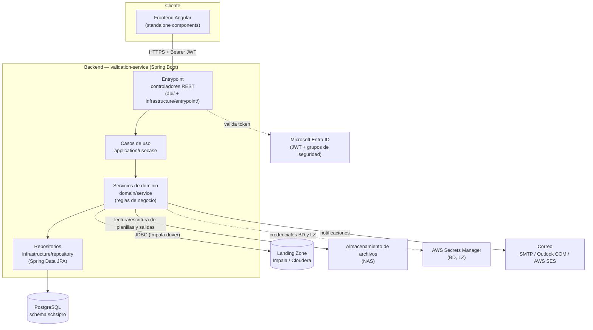
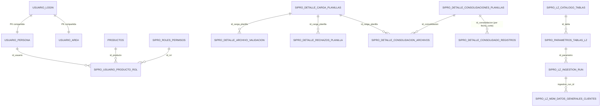
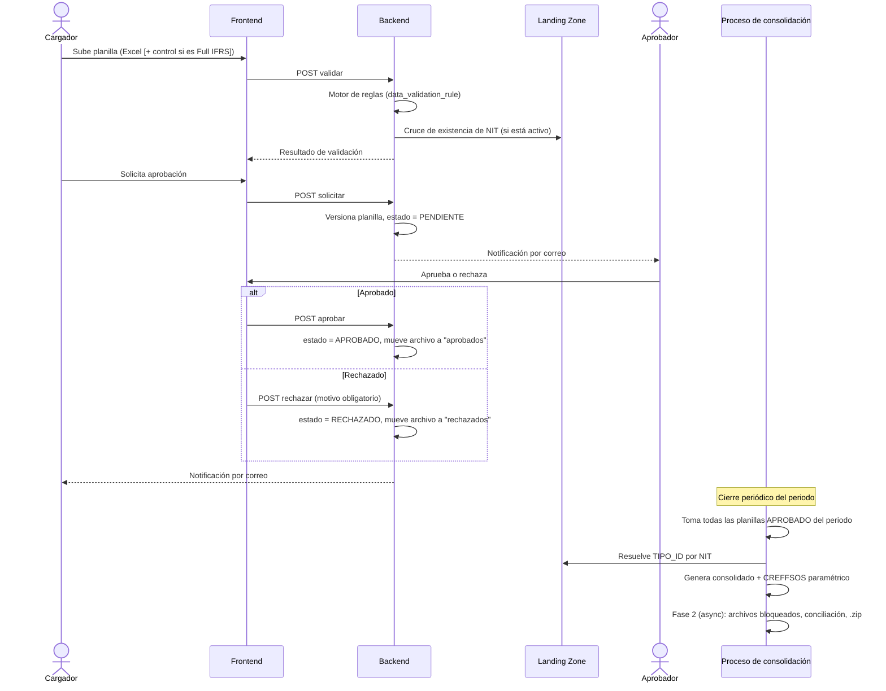

# SIPRO — Sistema Integral de Provisiones

## 1. Introducción / Resumen ejecutivo

SIPRO centraliza el ciclo completo de **carga, validación, aprobación, consolidación y conciliación de planillas manuales de provisiones** para dos segmentos contables:

- **Colgaap/Modificado** (`id_segmento = 1`)
- **Full IFRS** (`id_segmento = 2`)

El resultado final de ese ciclo es un archivo **CREFFSOS** (el formato de entrada del sistema **BankVision**), generado de forma paramétrica a partir de configuración en base de datos, no de lógica fija en código. SIPRO es, en esencia, el punto de control humano (carga → validación automática → aprobación por un líder) antes de que la información de provisiones llegue a BankVision.

Para enriquecer y validar esa información, SIPRO se conecta como cliente de solo lectura a la **Landing Zone corporativa** (un clúster Impala) para cruzar el documento de cada cliente contra un catálogo maestro de clientes y resolver su tipo de identificación.

**Perfiles de usuario (roles funcionales reales, ver [Seguridad y control de acceso](#9-seguridad-y-control-de-acceso)):** Cargador, Aprobador, Usuario_Analista, Auditoría, Soporte Técnico y Admin_Permisos.

**Nota sobre el alcance de este documento:** el repositorio también contiene una carpeta `ABA/` en la raíz. **No es parte de SIPRO** — es un proyecto Spring Boot completamente independiente (su propio `.git`, su propio build Gradle, su propio Dockerfile), que vive físicamente junto a SIPRO solo por conveniencia de espacio de trabajo. La única relación real es de referencia: SIPRO reutiliza la misma librería corporativa de AWS Secrets Manager que usa ABA, y ABA dejó documentado un patrón de envío de correo por AWS SES (`ABA/SES_HANDOFF.md`) pensado para que SIPRO lo replicara. Este README no documenta ABA.

## 2. Índice

- [1. Introducción / Resumen ejecutivo](#1-introducción--resumen-ejecutivo)
- [3. Arquitectura general](#3-arquitectura-general)
- [4. Stack tecnológico](#4-stack-tecnológico)
- [5. Estructura del repositorio](#5-estructura-del-repositorio)
- [6. Módulos funcionales](#6-módulos-funcionales)
- [7. Modelo de datos](#7-modelo-de-datos)
- [8. Integración con Landing Zone (Impala)](#8-integración-con-landing-zone-impala)
- [9. Seguridad y control de acceso](#9-seguridad-y-control-de-acceso)
- [10. Configuración y variables de entorno](#10-configuración-y-variables-de-entorno)
- [11. Almacenamiento de archivos](#11-almacenamiento-de-archivos)
- [12. Despliegue e infraestructura](#12-despliegue-e-infraestructura)
- [13. Flujos operativos principales](#13-flujos-operativos-principales)
- [14. Glosario](#14-glosario)

## 3. Arquitectura general

SIPRO es un backend único (`validation-service`, Spring Boot) consumido por un frontend Angular, con PostgreSQL como base de datos transaccional y tres integraciones externas: el proveedor de identidad corporativo (Entra ID), la Landing Zone analítica (Impala) y el almacenamiento de archivos (NAS).



La arquitectura del backend está organizada en capas: una capa de entrada (controladores REST), una capa de casos de uso, una capa de dominio y una capa de infraestructura. La mayor parte de la lógica de negocio vive en los **servicios de dominio** (36 clases), que orquestan directamente las reglas de negocio de carga, validación, aprobación, consolidación y generación de CREFFSOS.

## 4. Stack tecnológico

| Capa | Tecnología | Notas |
|---|---|---|
| Backend | Java 17 (toolchain Gradle) | |
| Backend | Spring Boot 3.4.0 | |
| Backend | Spring Data JPA, Spring Security, Spring Mail, Spring Cache (Caffeine) | |
| Backend | PostgreSQL (driver `org.postgresql:postgresql:42.7.1`) | Esquema `schsipro` |
| Backend | Apache POI `5.2.5` | Lectura/escritura de Excel (planillas, CREFFSOS, reportes) |
| Backend | Apache Commons JEXL `3.3` | Motor de fórmulas del motor de reglas de validación |
| Backend | Driver JDBC Impala (`ImpalaJDBC42.jar`, dependencia local en `libs/`) | Conexión a la Landing Zone |
| Backend | AWS SDK v2 (S3, SES v2) + librería corporativa `aws-secrets-manager-sync` | Misma librería de secretos que usa el proyecto ABA |
| Backend | Gradle (build multi-módulo, un único módulo real: `services:validation-service`) | Empaqueta `sipro.jar` |
| Frontend | Angular `^20.0.0` (componentes standalone, sin `NgModule` activo) | Bootstrap vía `main.ts` + `app.routes.ts` |
| Frontend | TypeScript `~5.8.3` | |
| Frontend | RxJS `~7.8.0` | |
| Frontend | `@azure/msal-browser` `^4.26.1` | Autenticación contra Entra ID desde el navegador |
| Frontend | `xlsx` `^0.18.5` | Manejo de Excel en cliente |
| Despliegue | AWS (máquinas y servidor PostgreSQL ya aprovisionados), JAR directo sobre la JVM | Ver [sección 12](#12-despliegue-e-infraestructura) |

## 5. Estructura del repositorio

```
SIPRO/
├── backend/
│   ├── settings.gradle                  # único módulo: services:validation-service
│   ├── deployment/                      # Dockerfile + chart Helm
│   └── services/validation-service/
│       ├── build.gradle
│       └── src/main/
│           ├── java/com/bancolombia/sipro/validations/
│           │   ├── api/                      # controladores REST (grupo 1, ver más abajo)
│           │   ├── application/
│           │   │   ├── usecase/              # 6 casos de uso (login, planilla, validación, ingesta LZ, acta)
│           │   │   └── dto/
│           │   ├── domain/
│           │   │   ├── service/              # ~36 servicios de dominio — el grueso de la lógica de negocio
│           │   │   └── model/                # ~32 entidades JPA
│           │   ├── infrastructure/
│           │   │   ├── entrypoint/           # controladores REST (grupo 2, ver nota abajo)
│           │   │   ├── config/                # seguridad, JPA, storage, LZ, panel admin
│           │   │   ├── repository/            # repositorios Spring Data JPA (grueso)
│           │   │   ├── persistence/           # repositorios y entidades adicionales
│           │   │   ├── security/              # validación de JWT Entra ID, filtros, RBAC
│           │   │   ├── storage/                # implementaciones local/S3 de FileStorageService
│           │   │   ├── lz/                     # cliente JDBC a Impala, manejo de secretos LZ
│           │   │   ├── notification/           # envío de correo (4 transportes)
│           │   │   └── adapters/{in,out}/      # adaptadores puerto-entrante/saliente
│           │   └── shared/                     # utilidades y excepciones comunes
│           └── resources/
│               ├── application*.yml            # config por ambiente (ver sección 10)
│               └── db/changelog/                # historial de cambios de base de datos
├── frontend/
│   └── src/
│       ├── main.ts                      # bootstrap standalone real
│       ├── environments/                # config por ambiente (apiUrl, credenciales Azure)
│       └── app/
│           ├── app.routes.ts            # rutas activas (8 rutas + guards)
│           ├── guards/                  # 7 guards funcionales
│           ├── interceptors/            # inyección de Bearer token
│           ├── services/                # clientes HTTP hacia el backend
│           ├── models/
│           └── components/              # login, inicio, cargar, aprobacion, resumen, admin, parametros, tablero
└── ABA/                                 # proyecto independiente, no forma parte de SIPRO (ver sección 1)
```

## 6. Módulos funcionales

### Carga y validación de planillas

**Flujo real, de punta a punta:** el usuario sube un archivo Excel (Colgaap) o Excel + archivo de control `.txt` (Full IFRS, con la cantidad de registros esperada) a `POST /api/validar` (o su variante asíncrona `/api/validar/async` para archivos grandes). El resultado de esa validación queda cacheado en memoria (`LoteMemoryStore`, identificado por un `validacionLoteId`) — cuando el usuario decide "solicitar aprobación" (`POST /api/planillas/solicitar`), el sistema **reutiliza el archivo ya validado en caché** en vez de pedirlo de nuevo, lo sube a almacenamiento bajo `pendientes/{fecha}/`, **versiona la planilla** (la versión anterior del mismo producto+fecha se inactiva mediante un bloqueo pesimista `SELECT ... FOR UPDATE`, para evitar condiciones de carrera si dos cargas llegan casi al mismo tiempo) y la deja en estado `PENDIENTE`.

**Motor de reglas — 100% parametrizado en la tabla `data_validation_rule`**, no hay reglas de estructura/tipo/fecha hardcodeadas en Java. Soporta 5 tipos de regla (`rule_kind`):

| `rule_kind` | Qué valida |
|---|---|
| `FIELD` | Obligatoriedad, tipo de dato (entero/decimal, con mínimo/máximo y si permite negativos), longitud máxima, expresión regular, lista de valores permitidos, o una **fórmula libre en Apache Commons JEXL** (`validation_formula`) — el motor JEXL corre en modo `UNRESTRICTED` porque las fórmulas provienen de reglas administradas por la propia aplicación, no de texto libre ingresado por el usuario final |
| `COMPOSITE_DATE` | Arma una fecha real a partir de 3 columnas separadas (año/mes/día) y valida que esa combinación exista en el calendario |
| `DATE_RELATION` | Compara dos fechas compuestas entre sí, o contra la fecha de corte elegida por el usuario (variable `VAR_FECHA_CORTE`), con operadores `<=`, `<`, `>=`, `>`, `==`, `!=` |
| `CTRL_CONTENT` / `CTRL_RECORD_COUNT` | Exclusivas del archivo de control `.txt` de Full IFRS |

Además del motor parametrizado, existen validaciones de negocio fijas en código (no configurables desde la tabla de reglas): unicidad de DOCUMENTO+MONEDA por archivo, exclusión del NIT propio de Bancolombia, existencia del NIT contra la Landing Zone (activable/desactivable por parámetro `VALIDAR_NIT_EXISTENCIA_LZ`), y existencia de la cuenta contable (CTAPUC) contra la tabla de homologación SAP (solo aplica al segmento Colgaap).

**Diferencia Colgaap vs. Full IFRS:** Full IFRS exige el segundo archivo de control y, cuando el usuario certifica un producto como "Sin Datos" para el periodo, el sistema genera automáticamente un Excel vacío con sus 23 encabezados fijos más un `.txt` con "0" — en Colgaap, "Sin Datos" solo deja un registro de certificación sin archivo real asociado.

### Aprobación y rechazo

Solo el **líder asignado a esa planilla específica** (columna `id_lider`) puede aprobar o rechazar — la autorización efectiva se valida comparando ese campo contra el usuario autenticado, **no** contra el flag genérico de permiso "aprobar" del rol. El rechazo exige un motivo obligatorio, verificado en dos capas: el controlador rechaza la petición (HTTP 400) si viene vacío, y el motivo se persiste en `sipro_detalle_rechazos_planilla` junto con la etapa del rechazo, antes de cambiar el estado de la planilla.

Al aprobar, el archivo se mueve de `pendientes/` a `aprobados/{fecha}`; al rechazar, se mueve a `rechazados/{fecha}` y la planilla queda disponible para que el usuario cargue una nueva versión. Si es Full IFRS, la aprobación además copia los archivos a una carpeta de red compartida y, cuando **todas** las planillas Full IFRS del periodo quedan aprobadas, dispara automáticamente la generación de un archivo de homologación.

Cada acción (solicitud, aprobación, rechazo) dispara una notificación por correo, con **4 transportes intercambiables** según el ambiente: `preview` (solo registra en log, usado en desarrollo), `smtp`, `outlook-win32` (automatiza Outlook vía PowerShell/COM en un host Windows on-prem — es el *default* global del sistema) y `ses-api` (AWS SES, el transporte acordado para producción).

### Consolidación

Cierre periódico (mensual) que reconstruye por completo el consolidado de un periodo a partir de las planillas aprobadas, procesando Colgaap y Full IFRS de forma independiente dentro del mismo cierre, y termina generando el archivo CREFFSOS. Incluye varias protecciones operativas:

- **Candado de PostgreSQL por periodo** (`pg_try_advisory_xact_lock`): evita que dos intentos de consolidar el mismo periodo corran a la vez, sin importar si el disparo viene del botón manual, del cierre automático mensual o de la cascada que se dispara al aprobar una planilla atrasada. Se libera solo, incluso si el proceso se cae a mitad de camino.
- **Límite de tiempo configurable por parámetro** (ajustable sin redeploy) para que una ejecución nunca quede indefinidamente "colgada" esperando algo del lado de la base de datos.
- **Cruce de NIT contra la LZ una sola vez por periodo** (no uno por cada planilla Full IFRS), para no repetir consultas redundantes cuando el mismo cliente aparece en varias planillas.
- Una segunda fase asíncrona ("Fase 2 / archivos bloqueados", ver más abajo) que corre después de confirmarse la Fase 1.
- El correo de confirmación se envía **después** de que la consolidación queda confirmada en base de datos (no a mitad de la transacción), para no sostener la conexión abierta mientras dura el envío.

### Generación paramétrica de CREFFSOS

El layout de columnas del archivo de salida se define fila por fila en la tabla `sipro_parametros_columnas_creffsos` (se administra por SQL directo, no es una entidad JPA) y se resuelve en tiempo de ejecución mediante un **catálogo cerrado de funciones Java registradas** — entre ellas: copiar un valor directo, asignar una constante, resolver el consecutivo de documento, resolver la clasificación PUC, resolver la cuenta BankVision, resolver clase de garantía o calificación cruzando contra la LZ (`resolverClaseGarantiaDesdeCenie` / `resolverCalificacionDesdeCenie`, contra `resultados_vspc_finanzas.sipcen_visionry_cenie`), y variantes condicionales ("copiar solo si viene informado", "constante solo si el campo de origen tiene dato"). Las funciones de tipo *lookup* leen una tabla/llave/valor configurados en un campo JSON de parámetros (`lookupSchema`/`lookupTable`/`lookupKey`/`lookupValue`), consultando indistintamente PostgreSQL o la Landing Zone según cómo esté configurada esa columna.

El formato de salida (XLSX por defecto, o CSV/TSV con separador configurable), el nombre del archivo y si incluye fila de encabezado son todos configurables por parámetro, sin tocar código.

### Fase 2 — archivos bloqueados

Paso asíncrono que corre en segundo plano **después** de que la Fase 1 de la consolidación ya quedó confirmada. Publica copias **protegidas contra edición** (protección de hoja de Excel/Word con una contraseña fija, no es cifrado real) del CREFFSOS, de las planillas Full IFRS aprobadas, y de un Excel de conciliación bloqueados-vs-desbloqueados — todo organizado por periodo y comprimido en un único `.zip` al cierre. Cuando el CREFFSOS ya se generó en la Fase 1, la Fase 2 **reutiliza ese mismo archivo** en vez de volver a generarlo, precisamente para no avanzar dos veces el consecutivo reservado en base de datos.

### Conciliación

Compara el consolidado interno contra el archivo CREFFSOS ya publicado (documento vs. documento) y genera un reporte Excel con el resumen por producto y el detalle de las diferencias, si las hay. Este reporte se genera **bajo demanda**, cuando el usuario lo descarga — ya no se genera automáticamente dentro del cierre periódico, porque ese cálculo automático nunca se guardaba en ningún lado (se regeneraba desde cero de todas formas al descargarlo), así que hacerlo también en el cierre solo repetía trabajo sin ningún beneficio.

### Panel de administrador

| Función | Endpoint / mecanismo |
|---|---|
| Dashboard operativo | `GET /api/admin/dashboard` — periodos disponibles, estado de la ventana de carga, archivos pendientes/rechazados/consolidados, histórico de las últimas 20 consolidaciones |
| Consolidación manual | `POST /api/admin/consolidacion/manual` — restringido al rol Admin_Permisos |
| Eliminar una consolidación | `DELETE /api/admin/consolidacion/{id}` |
| Consola SQL restringida | `POST /api/admin/sql/execute` |
| Logs operativos en vivo | `GET /api/admin/logs` — por *polling* con cursor, no un stream real |

La consola SQL bloquea sentencias múltiples y comentarios (`;`, `--`, `/* */`), bloquea una lista negra de palabras peligrosas (`delete, truncate, drop, alter, create, grant, revoke, comment, copy`), exige cláusula `WHERE` en los `UPDATE`, exige que el operador escriba una justificación para cualquier escritura, agrega un `LIMIT` automático a los `SELECT` que no lo traigan, y audita cada ejecución con usuario, tablas tocadas y filas afectadas.

### Integración con Landing Zone

Ver sección dedicada: [Integración con Landing Zone (Impala)](#8-integración-con-landing-zone-impala).

## 7. Modelo de datos

Todas las tablas viven en el esquema `schsipro`. El modelo se agrupa en cuatro dominios funcionales.

### Identidad, RBAC y catálogos

| Tabla | Propósito |
|---|---|
| `usuario_login` | Identidad raíz del usuario (usuario, clave) |
| `usuario_persona` | Datos personales, extiende `usuario_login` por PK compartida |
| `usuario_area` | Área organizacional y jefe/líder (auto-referenciada), extiende `usuario_login` por PK compartida |
| `sipro_roles_permisos` | Catálogo de roles con matriz de permisos por acción (`visualizar`, `cargar_archivos`, `aprobar`, `modificar_parametros`, etc.) y el `grupo_ad` de Entra ID asociado |
| `sipro_usuario_producto_rol` | Tabla puente RBAC real: llave compuesta `id_usuario + id_producto + id_rol + id_segmento` |
| `productos` | Catálogo maestro de productos cargables |
| `segmentos` | Catálogo maestro de segmentos (Colgaap/Modificado, Full IFRS) |

### Parametrización y reglas

| Tabla | Propósito |
|---|---|
| `data_validation_rule` | Motor de reglas de validación configurable (ver [módulo de carga](#6-módulos-funcionales)) |
| `sipro_parametros_unico` | Parámetros clave-valor genéricos del sistema |
| `sipro_parametros_columnas_creffsos` | Layout configurable del archivo CREFFSOS (no es entidad JPA, acceso por SQL directo) |
| `sipro_parametros_homologacion_colgaap` / `sipro_parametros_homologacion_full_ifrs` | Homologación de cuentas contables SAP↔BV / SAP↔planilla, por segmento |
| `sipro_parametros_reglaventanacarga` | Regla general de apertura/cierre de la ventana de carga |
| `sipro_parametros_excepcionventanacarga` | Excepciones puntuales por periodo a esa ventana |
| `sipro_parametros_rango_habilitado` | Rango de meses habilitado en el selector de fecha de corte |

### Carga, consolidación y conciliación

| Tabla | Propósito |
|---|---|
| `sipro_detalle_carga_planillas` | Planilla cargada: ruta de almacenamiento, `estado_planilla`, `id_lider`, fecha de corte |
| `sipro_detalle_archivo_validacion` | Métricas de calidad de la validación de un archivo |
| `sipro_detalle_rechazos_planilla` | Auditoría de rechazos (motivo, etapa, usuario) |
| `sipro_resumen_por_moneda` | Resumen por moneda de una validación |
| `sipro_detalle_consolidaciones_planillas` | Cabecera de una corrida de consolidación por periodo (`estado_consolidacion`) |
| `sipro_detalle_consolidacion_archivos` | Relación de cada archivo aprobado que entró en una consolidación |
| `sipro_detalle_consolidado_registros` | Fila consolidada individual (una por registro de negocio) |

**Valores de estado usados por el sistema:**
- `estado_planilla`: `PENDIENTE`, `APROBADO`, `RECHAZADO` (más variantes de presentación en el frontend para el caso "sin datos").
- `estado_consolidacion`: `INICIADO`, `EN_PROCESO`, `COMPLETADO`, `COMPLETADO_CON_ADVERTENCIAS`, `ERROR`.
- `estado` de un run de ingesta LZ: `STARTED`, `SUCCESS`, `FAILED`, `INCOMPLETE`.

El discriminador de segmento (`id_segmento`/`idSegmento` = 1 Colgaap/Modificado, 2 Full IFRS) identifica el segmento contable en la mayoría de las tablas del modelo, junto con un campo `segmento` de texto libre (nombre) para presentación.

### Landing Zone

| Tabla | Propósito |
|---|---|
| `sipro_lz_catalogo_tablas` | Catálogo de tablas replicables desde la LZ |
| `sipro_parametros_tablas_lz` | Parámetro de ingesta con el `query_sql` completo a ejecutar en Impala |
| `sipro_lz_ingestion_run` (+ variante `_default`) | Control/histórico de cada ejecución de ingesta |
| `sipro_lz_mdm_datos_generales_clientes` (+ `_stg`, `_default`, `_stg_default`) | Tabla espejo de clientes MDM: staging, destino final y particiones `DEFAULT` de PostgreSQL |

### Diagrama entidad-relación (grupos principales)



## 8. Integración con Landing Zone (Impala)

La **Landing Zone** es la capa corporativa de datos analíticos de Bancolombia, expuesta vía un clúster **Impala/Cloudera**. SIPRO se conecta como cliente de **solo lectura**, sin pool de conexiones (cada operación abre y cierra su propia conexión JDBC, decisión deliberada para no mantener conexiones permanentes contra un sistema externo).

**Para qué se usa dentro de SIPRO:**
1. **Validación de existencia de NIT** durante la carga de planillas: se cruza el documento del cliente contra el catálogo maestro replicado, activable/desactivable por parámetro.
2. **Resolución del tipo de identificación (`TIPO_ID`)** durante la consolidación (Colgaap y Full IFRS), cuando el archivo de origen no lo trae.

**Tablas de origen en Impala (zona.tabla):**

| Uso | Zona | Tabla |
|---|---|---|
| Catálogo maestro de clientes (validación de NIT, resolución de `TIPO_ID`, ingesta periódica hacia PostgreSQL) | `resultados_fcr` | `fcr_mdm_datos_generales_clientes` |
| Cruce con CENIE (clase de garantía y calificación, generación paramétrica de CREFFSOS) | `resultados_vspc_finanzas` | `sipcen_visionry_cenie` |

La tabla del catálogo de clientes es configurable por parámetro (`APP_LZ_SCHEMA` / `APP_LZ_TABLE_MDM`, ver `application.yml`); en DEV/QA se sustituye por una tabla dummy sembrada localmente (`LzDevSeedService`). El cruce con CENIE se resuelve por fuera de ese mecanismo, como una función de tipo *lookup* del generador paramétrico de CREFFSOS (ver [Generación paramétrica de CREFFSOS](#generación-paramétrica-de-creffsos)).

**Mecanismo de conexión:** driver JDBC nativo de Impala, autenticación LDAP (usuario/clave) sobre TLS, con un truststore propio aislado del truststore SSL global de la JVM (para no interferir con la validación de tokens de Entra ID, que también usa HTTPS).

**Ingesta periódica (replicación hacia PostgreSQL):** un proceso programado trae los datos del catálogo de clientes a una tabla espejo local, con un flujo *staging → validación de conteos → promoción transaccional a la tabla final*. Incluye salvaguardas reales:
- Un guard de concurrencia que evita que dos ingestas de la misma tabla corran en paralelo.
- Un guard por periodo: si el mes actual ya tuvo una ejecución exitosa, no se repite (salvo forzado).
- Recuperación automática de ejecuciones interrumpidas (por ejemplo, si el servidor se reinició a mitad de proceso): cualquier ejecución que quede "en curso" más tiempo del esperado se marca como fallida automáticamente, y se limpian los datos parciales huérfanos.
- Disparo automático en tres momentos: una verificación única poco después de arrancar el backend, y un chequeo diario que **fuerza** la ingesta el día 1 y el último día de cada mes (dos fotos obligatorias del mes), actuando como reintento silencioso de respaldo el resto de los días.

**Credenciales por ambiente:**

| Ambiente | Mecanismo |
|---|---|
| Desarrollo | Bypass directo por variables de entorno (usuario/clave de prueba), o AWS Secrets Manager simulado (LocalStack) |
| QA / Producción | AWS Secrets Manager real — las variables de bypass deben quedar vacías |

## 9. Seguridad y control de acceso

### Autenticación

El frontend autentica al usuario contra **Microsoft Entra ID** (vía MSAL) y envía el ID token al backend (`POST /api/auth/login`). El backend valida ese JWT de forma real contra el JWKS de Entra ID (issuer, audiencia, firma) mediante `EntraIdTokenService`, aplicado en cada petición protegida por `EntraAuthenticationFilter` + `SecurityConfig` — no hay modo `permitAll` ni bypass en ningún perfil, dev incluido. Ver [backend/SECURITY.md](backend/SECURITY.md).

Cada petición subsiguiente pasa por un filtro que revalida el token y exige que el usuario **ya exista previamente** en SIPRO — no hay auto-registro (auto-provisioning): si el usuario no existe, la petición se rechaza.

### Autorización (RBAC)

Los grupos de seguridad del usuario llegan en el propio ID token (claim `groups`); si el usuario pertenece a demasiados grupos para caber en el token, se complementa con una consulta a Microsoft Graph. Esos grupos se normalizan (minúsculas, sin guiones/espacios/prefijos corporativos) y se cruzan contra la columna `grupo_ad` de `sipro_roles_permisos` (también normalizada) para determinar los roles efectivos del usuario — **ese mapeo vive en base de datos, no en código ni en ningún archivo de configuración**. Con los roles efectivos ya resueltos, se filtran las asignaciones de `sipro_usuario_producto_rol` para obtener los permisos reales por producto.


**Roles funcionales:** los nombres y `grupo_ad` exactos se administran en base de datos (`sipro_roles_permisos`), no en código:

| id_rol | Rol | Controla, entre otros |
|---|---|---|
| 1 | Cargador | Carga de archivos |
| 2 | Aprobador | Aprobación/rechazo de planillas |
| 3 | Soporte Técnico | Acceso al panel admin (dashboard técnico, consola SQL, logs) |
| 4 | Usuario_Analista | — |
| 5 | Auditoría | — |
| 6 | Admin_Permisos | Gestión de parámetros, ejecución de consolidación manual |

**Endpoints públicos** (sin autenticación): health checks, `/error`, login, y la configuración pública de Entra ID. **Todo lo demás exige un token válido.** La restricción fina por rol (por ejemplo, quién entra a `/admin` o a `/parametros`) se valida dentro de los propios servicios de dominio.

### Manejo de secretos

- El secreto de Entra ID (`AZURE_CLIENT_SECRET`) y otros 3 parámetros críticos se leen **exclusivamente** de configuración/variables de entorno — nunca de la tabla de parámetros de base de datos, aunque exista un valor ahí, precisamente para que ese secreto nunca quede en BD.
- Credenciales de la base de datos principal y de la Landing Zone: AWS Secrets Manager en QA/producción (LocalStack en desarrollo).
- No hay credenciales reales de producción en el código.
- Los archivos Excel de salida protegidos (CREFFSOS, planillas Full IFRS bloqueadas en la Fase 2) usan una contraseña de protección de hoja fija, pensada para evitar ediciones accidentales — no es un control de acceso.

## 10. Configuración y variables de entorno

El backend usa archivos de configuración por ambiente (`application-<perfil>.yml`) más un archivo especial **autosuficiente** para los despliegues reales (`application-cloud.yml`), pensado para arrancar el JAR apuntando directamente a él, con tokens `#{VARIABLE}#` que el pipeline de Azure DevOps reemplaza según el ambiente (patrón "Replace Tokens").

| Archivo | Cuándo se usa |
|---|---|
| `application.yml` | Base común; defaults genéricos |
| `application-dev.yml` | Ejecución local desde IDE en la máquina del desarrollador |
| `application-cloud.yml` | El que se usa en los despliegues reales en AWS (DEV, QA y PDN), vía reemplazo de tokens |

**Diferencias clave por ambiente:**

- **Almacenamiento:** apunta a la carpeta de red compartida (NAS) dedicada a SIPRO, tanto en desarrollo como en los despliegues reales. Ver [Almacenamiento de archivos](#11-almacenamiento-de-archivos).
- **Landing Zone:** desarrollo y QA comparten el mismo host intermedio con datos de prueba sembrados automáticamente; producción apunta al host corporativo real, sin datos sembrados.
- **Correo:** desarrollo fuerza modo "preview" (solo registra en log, no envía nada real); producción usa AWS SES vía API; el resto de ambientes puede usar SMTP u Outlook (vía automatización COM en un host Windows on-prem), transporte que es el *default* global del sistema.
- **Base de datos:** el tamaño del pool de conexiones crece de un valor pequeño en desarrollo genérico a 30 conexiones en producción/cloud.
- **Gestor de secretos:** AWS Secrets Manager para las credenciales de base de datos y de la Landing Zone.
- **Entra ID / URLs de cada ambiente:** se leen siempre de configuración o variables de entorno, nunca de la base de datos.
- **CORS en producción** no tiene valor por defecto a propósito — si el pipeline no lo inyecta, el sistema bloquea el acceso en vez de abrir orígenes sin querer.

**Variables más relevantes para un primer despliegue** (nombres, no valores): perfil de Spring activo, credenciales/URL de base de datos (o el nombre del secreto en Secrets Manager), ruta de almacenamiento, orígenes permitidos de CORS, credenciales de la aplicación de Entra ID, URLs propias de cada ambiente, host/puerto/credenciales de la Landing Zone y su truststore, y la configuración de correo (habilitado/transporte/remitente).

## 11. Almacenamiento de archivos

`FileStorageService` es la interfaz única para guardar/leer archivos (planillas, Excel consolidados, CREFFSOS), configurada mediante una ruta base (`app.storage.local.base-dir`) que apunta a una **carpeta de red compartida (NAS) dedicada a SIPRO**. En desarrollo, esa ruta es `\\SBMDEBNS03\BFT\SIPRO\planillas`. Ahí es donde el sistema va guardando todo lo que pasa por `FileStorageService`: las planillas cargadas por los usuarios (organizadas en subcarpetas `pendientes/{fecha}`, `aprobados/{fecha}`, `rechazados/{fecha}`, `inactivos/{fecha}`), los Excel consolidados y los archivos CREFFSOS generados. En los ambientes desplegados en AWS, esa misma ruta base la inyecta el pipeline de release vía el token `APP_STORAGE_LOCAL_BASE_DIR` sobre `application-cloud.yml` (ver [sección 12](#12-despliegue-e-infraestructura)).

Además del `FileStorageService`, SIPRO usa **rutas de red compartidas adicionales**, configuradas por sus propios parámetros, para publicar copias finales de Excel y CREFFSOS que consumen sistemas externos.

## 12. Despliegue e infraestructura

SIPRO corre sobre infraestructura de **AWS** ya aprovisionada (máquinas y servidor de PostgreSQL ya configurados); el backend se ejecuta como JAR directo sobre la JVM en esas máquinas.

**Repositorio y pipelines:** el código fuente que efectivamente se despliega vive en un repositorio de **Azure DevOps**, separado del control de versiones de este checkout, organizado en dos carpetas de alto nivel: `Frontend/` y `Backend/`. En ese repositorio están configurados los pipelines de **build** y de **release** de Azure DevOps (no hay archivos de pipeline versionados dentro de este monorepo).

**Arranque del backend:** el ambiente desplegado se levanta apuntando explícitamente al archivo `application-cloud.yml` (`backend/services/validation-service/src/main/resources/application-cloud.yml`), pasado como argumento de arranque en vez de activarse por un perfil Spring convencional:

```
java -Duser.timezone=America/Bogota -jar sipro.jar --spring.config.location=file:/ruta/application-cloud.yml
```

Ese archivo es **autosuficiente** (no depende de `application.yml` empaquetado en el JAR) y es el **mismo archivo para DEV, QA y PDN** — lo que cambia entre ambientes son los valores que se le inyectan, no el archivo.

**Sustitución de variables:** el pipeline de *release* en Azure DevOps ejecuta la tarea **Replace Tokens**, que reemplaza cada marcador con la sintaxis `#{NOMBRE_VARIABLE}#` presente en `application-cloud.yml` (credenciales de BD, credenciales de Entra ID, credenciales/host de la Landing Zone, configuración de correo, CORS, etc.) por el valor real tomado del Variable Group de Azure DevOps correspondiente al ambiente (DEV, QA o PDN). Tras ese reemplazo, el pipeline empaqueta el resultado como artefacto de release y lo despliega a la máquina AWS del ambiente correspondiente.

**Frontend:** se despliega desde la carpeta `Frontend/` de ese mismo repositorio de Azure DevOps, con su propio build y release, a partir del build de producción de Angular (`ng build`).

## 13. Flujos operativos principales

### De la carga de un archivo a su consolidación



## 14. Glosario

| Término | Significado |
|---|---|
| CREFFSOS | Archivo de salida que produce SIPRO, formato de entrada del sistema destino BankVision |
| Landing Zone (LZ) | Capa corporativa de datos analíticos (Impala) usada como fuente externa de datos de clientes |
| RBAC | Control de acceso basado en roles funcionales, mapeados a grupos de Entra ID vía la tabla `sipro_roles_permisos` |
| Segmento | Clasificación contable de una planilla: Colgaap/Modificado (1) o Full IFRS (2) |
| Planilla | Archivo manual de provisiones que un usuario carga al sistema |
| Fase 2 / archivos bloqueados | Paso asíncrono posterior a la consolidación que publica copias protegidas contra edición de los archivos finales |
| Motor de reglas | Sistema de validación de archivos configurado en la tabla `data_validation_rule`, no hardcodeado |
| Ingesta LZ | Proceso periódico que replica el catálogo de clientes de la Landing Zone hacia PostgreSQL |
| Consecutivo | Número secuencial reservado por el generador de CREFFSOS para ciertas columnas de salida |
